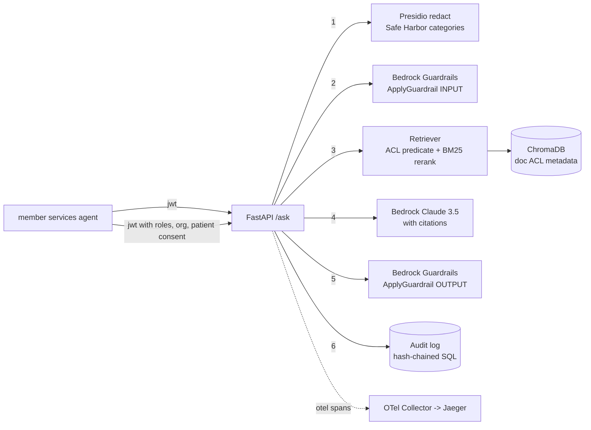

# compliance-rag-pii-redaction

Reference architecture for compliance-constrained retrieval augmented
generation over regulated healthcare text. The goal is a documented,
inspectable design that a Security Officer can walk end to end before
any actual PHI touches the pipeline; it is not a shipped product and it
has not been through a HIPAA readiness review.

## What this repo is

- A worked example of the layers you have to add to plain RAG before it
  clears a HIPAA-style review: PII/PHI de-identification, an identity
  and consent model, prompt and response guardrails, per-request audit,
  and a control-to-code mapping document.
- A code sketch of each layer against a specific stack (Presidio,
  ChromaDB, Bedrock, FastAPI, SQLAlchemy, OpenTelemetry).
- A written HIPAA control map in `docs/hipaa_mapping.md` and an on-prem
  migration outline in `docs/on_prem_deploy.md`.

## What this repo is NOT

- Not a deployed or production system.
- Not a certified HIPAA implementation.
- Not a substitute for a Security Officer review.
- Does not fine-tune the base model.
- Does not implement all 18 Safe Harbor identifiers; the Presidio
  pipeline ships with 8 custom HIPAA recognizers covering 16 identifier
  categories (identifier #17 is out of scope for a text-only pipeline;
  identifier #18 has no dedicated catch-all recognizer).
- Retrieval is dense with BM25 reranking over the dense candidate pool,
  not a fully independent hybrid.
- End-to-end integration against live Bedrock has not been executed;
  the code paths are unit-tested with Bedrock mocked.

## Architecture



Each numbered stage is a distinct span in the OTel trace and a distinct
column in the audit row.

## Request flow

1. Caller presents a bearer JWT with `roles`, `org_id`, and (optional)
   `consented_patient_ids`.
2. Question is passed through Presidio (`src/presidio_redact.py`) which
   strips or pseudonymizes the covered PHI categories. See the mapping
   table in `docs/hipaa_mapping.md`.
3. Redacted question hits Bedrock Guardrails as INPUT; if any policy
   triggers we return a canned refusal and write an audit row.
4. Retrieval enforces the ACL in Python (`src/retrieve.py::_doc_visible`):
   role, org, and patient-consent checks run over the candidate pool, so
   it works against any ChromaDB version. `_acl_where` is kept as the
   documented server-side predicate shape (it uses `$contains`, which the
   pinned ChromaDB does not accept for metadata, so it is not sent to the
   server) and is still exercised by the unit tests.
5. Dense retrieval against the ACL-filtered set, then BM25 reranking
   over the dense candidate pool, fused with reciprocal rank fusion.
6. Bedrock Claude 3.5 Sonnet generates an answer with inline
   `[source_id:pN#chunk]` citations. The system prompt refuses to
   answer without a chunk.
7. Response is passed back through Bedrock Guardrails as OUTPUT before
   it leaves the process.
8. Audit row is appended to the hash-chained log with request id,
   caller identity, question hash, retrieved chunk ids, redaction
   stats, guardrail verdicts, model, tokens, and cited chunk ids.

## HIPAA control map (quick view)

Full mapping in `docs/hipaa_mapping.md`. This is a design map, not an
assessment. Highlights:

| Control | Reg reference | Code path |
| --- | --- | --- |
| Safe Harbor de-identification (16 covered categories) | 45 CFR 164.514(b)(2) | `src/presidio_redact.py` + `configs/hipaa_recognizers.yaml` |
| Minimum necessary (design) | 45 CFR 164.502(b) | `src/retrieve.py::_acl_where` (Chroma-version-specific) and `_patient_filter` |
| Access control unique user id | 45 CFR 164.312(a)(2)(i) | `src/identity.py`, JWT `sub` claim |
| Automatic logoff | 45 CFR 164.312(a)(2)(iii) | JWT `exp` verification in `src/identity.py::decode_jwt` |
| Encryption at rest (reference IaC) | 45 CFR 164.312(a)(2)(iv) | `terraform/rds.tf`, `terraform/s3.tf` (never applied) |
| Audit controls | 45 CFR 164.312(b) | `src/audit.py` hash chain, `/audit` endpoint |
| Integrity - authenticate ePHI | 45 CFR 164.312(c)(2) | `AuditLog.verify_chain()` (unkeyed SHA-256 chain, tamper-evident only) |
| Person/entity authentication | 45 CFR 164.312(d) | JWT signature verification |
| Transmission security | 45 CFR 164.312(e) | reference: TLS everywhere, Bedrock via VPC endpoints in `terraform/vpc.tf` (not applied) |
| Accounting of disclosures | 45 CFR 164.528 | audit rows with `retrieved_chunk_ids` + `citations` |

The hash chain is unkeyed SHA-256; it is tamper-evident against a naive
editor but not "non-repudiable" and not cryptographically signed.

## Presidio coverage

Categories detected by the Presidio pipeline + custom recognizers:

- Names, geographic subdivisions, dates, telephone, fax, email, SSN
  (partially masked), MRN, health plan beneficiary, account numbers,
  certificate / license (DEA, NPI, DL), vehicle VIN, device serial,
  URLs, IP addresses, biometric identifiers.

Not covered:

- Full-face photographs (identifier #17): out of scope for a text-only
  pipeline.
- Catch-all for "any other unique code" (identifier #18): no dedicated
  detector.

## Quick start (runs offline, no keys)

The whole pipeline runs on a CPU box with no AWS credentials, no API keys
and no large downloads. When no AWS credentials are present the code takes
a local path: a deterministic hashing embedder replaces Titan, and a local
extractive generator (top-k retrieved chunks stitched into a cited answer)
replaces Claude. Presidio and ChromaDB already run locally on CPU. The
real Bedrock path stays selectable through `EMBEDDINGS_BACKEND` /
`GENERATOR_BACKEND` (or by providing AWS creds).

```bash
python -m venv .venv && source .venv/bin/activate   # optional
pip install -r requirements.txt
python -m spacy download en_core_web_sm              # ~12 MB, not the 560 MB lg

# end-to-end demo: ingest -> ask -> redact -> acl deny -> audit chain
make smoke        # or: SPACY_MODEL=en_core_web_sm python -m examples.smoke

# the offline unit tests (redaction + acl + audit chain + api surface)
SPACY_MODEL=en_core_web_sm pytest -q
```

`pytest -q` result on the machine this was verified on: **43 passed** (0
failed, 0 errors), collected from `tests/`.

Real output of `make smoke` (verbatim, hashing embeddings so it is
reproducible):

```text
offline smoke test  (workdir: ...\compliance_rag_smoke_xxxxxxxx)
embeddings backend : hash
generator backend  : local

====================================================================
1. INGEST synthetic policy documents
====================================================================
  ingested care_management_hf_stage3.md                2 chunks  [roles=nurse,case_manager,admin sensitivity=restricted]
  ingested coverage_policy_diabetes_supplies.md        3 chunks  [roles=nurse,case_manager,admin,member_services sensitivity=internal]
  ingested durable_medical_equipment_general.md        2 chunks  [roles=nurse,case_manager,admin sensitivity=internal]
  ingested formulary_glp1_step_therapy.md              2 chunks  [roles=nurse,case_manager,admin,member_services,pharmacist sensitivity=internal]
  ingested prior_auth_mri_lumbar.md                    2 chunks  [roles=nurse,case_manager,admin,member_services,reviewer sensitivity=internal]
  ---
  total chunks in store: 11

====================================================================
2. ASK a policy question (authorized nurse) -> cited answer
====================================================================
  user   : nurse-1 roles=['nurse'] org=acme-payer
  question: When is prior authorization required for a lumbar MRI?

  answer:
    Based on the retrieved plan policy documents:

    - Prior authorization required for elective outpatient MRI of the lumbar [prior_auth_mri_lumbar:p1#0]
    - Required for items > $500 acquisition cost. [durable_medical_equipment_general:p1#1]
    - is used for a medical purpose [durable_medical_equipment_general:p1#0]
    - least one preferred agent for a minimum of 90 days before non-preferred [formulary_glp1_step_therapy:p1#0]

  citations:
    - prior_auth_mri_lumbar p1 #chunk0
    - durable_medical_equipment_general p1 #chunk1
    - durable_medical_equipment_general p1 #chunk0
    - formulary_glp1_step_therapy p1 #chunk0

  retrieved 6 chunks from: ['coverage_policy_diabetes_supplies', 'durable_medical_equipment_general', 'formulary_glp1_step_therapy', 'prior_auth_mri_lumbar']

====================================================================
3. REDACT a PII-laden query -> before / after
====================================================================
  BEFORE:
    Patient John Smith (MRN: 000123456, SSN 412-34-5678, phone 617-555-0134, email john.smith@example.org) is asking whether his lumbar MRI needs prior authorization.

  AFTER (what the model actually sees):
    Patient PERSON_K2S6NPDXU7 (MRN_PADNUC37AG, <REDACTED> 412-34*****, phone PHONE_7N7RKYI3D7, email EMAIL_DI4B3SR63O) is asking whether his lumbar MRI needs prior authorization.

  entities detected: 10  by_type={'MEDICAL_RECORD_NUMBER': 1, 'EMAIL_ADDRESS': 1, 'PERSON': 1, 'ORGANIZATION': 2, 'DATE_TIME': 1, 'US_SSN': 1, 'PHONE_NUMBER': 1, 'URL': 2}

====================================================================
4. ACL enforcement -> unauthorized role is denied a restricted doc
====================================================================
  restricted doc     : care_management_hf_stage3  (allowed_roles=nurse,case_manager,admin)
  query              : heart failure stage 3 care management enrollment criteria

  nurse           sees: ['care_management_hf_stage3', 'coverage_policy_diabetes_supplies', 'durable_medical_equipment_general', 'formulary_glp1_step_therapy', 'prior_auth_mri_lumbar']
  member_services sees: ['coverage_policy_diabetes_supplies', 'formulary_glp1_step_therapy', 'prior_auth_mri_lumbar']

  OK: 'care_management_hf_stage3' visible to nurse, DENIED to member_services

====================================================================
5. AUDIT hash-chain -> append, verify, tamper, detect
====================================================================
  appended 3 rows. verify_chain() -> ok=True broken_at=0
  tampered: UPDATE audit_log SET roles='admin' WHERE id = 2
  verify_chain() -> ok=False broken_at=2
  OK: tamper detected at row 2

====================================================================
SMOKE TEST PASSED
====================================================================
  ingest -> ask -> redact -> acl deny -> audit chain all green.
```

Notes on the offline path:

- Embeddings default to a deterministic hashing vectorizer so the demo
  needs zero model downloads. Set `EMBEDDINGS_BACKEND=local` to use the
  `sentence-transformers` e5 model instead, or provide AWS creds to use
  Titan.
- Generation uses `LocalExtractiveGenerator`, which selects the most
  relevant sentence from each retrieved chunk and appends its citation.
  It is intentionally extractive and deterministic, not an LLM.
- The `$500` example threshold above is a synthetic policy value, not a
  real coverage rule.

## Quick start (full stack: Bedrock + Postgres)

```bash
# 1. install
python -m venv .venv && source .venv/bin/activate
pip install -r requirements.txt
python -m spacy download en_core_web_lg

# 2. env
cp .env.example .env
# fill in AWS creds, JWT_SECRET, PSEUDONYM_SALT (32+ hex chars)

# 3. audit db + vector store
alembic upgrade head            # postgres
python -m scripts.reindex_sample_policies

# 4. api + ui
make api                        # uvicorn on :8080
make ui                         # streamlit on :8501
```

`docker-compose.yml` builds the container images and stands up the
supporting services (ChromaDB, Postgres, Jaeger). The API container is
wired to a local persistent Chroma directory in the current code, so
the standalone chromadb service is stood up but not driven end to end
by the API in that layout; that wiring is a known gap.

## Layout

```
src/
  ingest.py              PDF/DOCX/MD ingestion with page provenance
  presidio_redact.py     Presidio wrapper with 8 custom HIPAA recognizers
  pseudonym.py           HMAC-based deterministic pseudonymization
  embed.py               Titan v2 / sentence-transformers / hashing embedder
  store.py               ChromaDB with per-doc ACL metadata
  retrieve.py            Python ACL filter + dense retrieval + BM25 rerank
  generate.py            Bedrock Claude 3.5 Sonnet or local extractive, cited
  guardrails.py          Bedrock Guardrails wrapper, escalation paths
  audit.py               Hash-chained audit log
  otel.py                OpenTelemetry GenAI-conv spans
  identity.py            JWT decode -> CallerIdentity
  api/main.py            FastAPI /ask /ingest /audit /health /redact/preview
  api/schemas.py         pydantic v2

configs/
  hipaa_recognizers.yaml
  guardrails_config.json
  system_prompt.md
  otel-collector.yaml

data/sample_policies/    Synthetic (only) clinical policies for demo
migrations/              alembic for audit_log
evals/                   eval set + runner (citation + pii leak checks)
scripts/                 reindex, jwt token issuer, salt rotation
tests/                   redact, acl filter, audit chain, guardrails, api, retrieve
terraform/               reference IaC (never applied): VPC private endpoints, IAM, RDS
docs/
  hipaa_mapping.md       Control map with covered / uncovered notes
  on_prem_deploy.md      Migration outline for an on-prem substitute stack
  audit_log_design.md    Chain invariants, snapshot rules, auditor workflow
```

## On-prem migration outline

See `docs/on_prem_deploy.md`. It is a design outline for what would
need to change to swap Bedrock and other AWS services for on-prem
substitutes (vLLM, NeMo Guardrails, on-prem Postgres, HashiCorp Vault).
The corresponding code branches are not implemented; the outline is
documentation.

## Notes on the sample data

Every file in `data/sample_policies/` is fabricated. Names, MRNs,
phone numbers, dates of birth are made up specifically to exercise
the redaction pipeline. Do not add real PHI to that folder.
