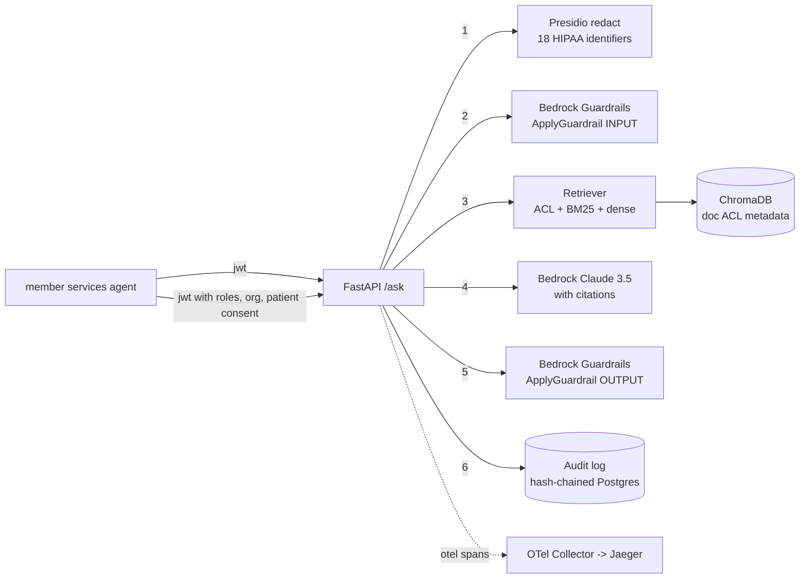

# compliance-rag-pii-redaction

Compliance-aware retrieval augmented generation for regulated data.

The concrete story: a health payer wants to give its member-services
agents an internal chatbot that answers questions from clinical policy
documents. Off-the-shelf RAG will not clear a HIPAA readiness review.
This repo is a reference for what it actually takes.

## One-liner

Presidio PII/PHI redaction plus AWS Bedrock Guardrails plus per-user
retrieval ACLs plus a tamper-evident audit log, on top of ChromaDB and
Claude 3.5 Sonnet.

## Architecture



Each numbered stage is a distinct span in the OTel trace and a distinct
column in the audit row.

## Request flow

1. Caller presents a bearer JWT with `roles`, `org_id`, and (optional)
   `consented_patient_ids`.
2. Question is passed through Presidio (`src/presidio_redact.py`) which
   strips or pseudonymizes the 18 HIPAA Safe Harbor identifiers. See
   the mapping table below.
3. Redacted question hits Bedrock Guardrails as INPUT; if any policy
   triggers we return a canned refusal and write an audit row.
4. Retrieval builds a Chroma `where` predicate from the caller identity
   (`src/retrieve.py`). Docs the caller cannot see are never scored.
5. Hybrid BM25 + dense retrieval, fused with RRF, top-K to the
   generator.
6. Claude 3.5 Sonnet on Bedrock generates an answer with inline
   `[source_id:pN#chunk]` citations. System prompt refuses to answer
   without a chunk.
7. Response is passed back through Bedrock Guardrails as OUTPUT before
   it leaves the process.
8. Audit row is appended to the hash-chained log with request id,
   caller identity, question hash, retrieved chunk ids, redaction
   stats, guardrail verdicts, model, tokens, and cited chunk ids.

## HIPAA control map (quick view)

Full mapping in `docs/hipaa_mapping.md`. Highlights:

| Control | Reg reference | Code path |
| --- | --- | --- |
| Safe Harbor de-identification (all 18) | 45 CFR 164.514(b)(2) | `src/presidio_redact.py` + `configs/hipaa_recognizers.yaml` |
| Minimum necessary | 45 CFR 164.502(b) | `src/retrieve.py::_acl_where` and `_patient_filter` |
| Access control unique user id | 45 CFR 164.312(a)(2)(i) | `src/identity.py`, JWT `sub` claim |
| Automatic logoff | 45 CFR 164.312(a)(2)(iii) | JWT `exp` verification in `src/identity.py::decode_jwt` |
| Encryption at rest | 45 CFR 164.312(a)(2)(iv) | `terraform/rds.tf` (RDS KMS), `terraform/s3.tf` (S3 KMS) |
| Audit controls | 45 CFR 164.312(b) | `src/audit.py` hash chain, `/audit` endpoint |
| Integrity - authenticate ePHI | 45 CFR 164.312(c)(2) | `AuditLog.verify_chain()` |
| Person/entity authentication | 45 CFR 164.312(d) | JWT signature verification |
| Transmission security | 45 CFR 164.312(e) | TLS everywhere, Bedrock via VPC endpoints in `terraform/vpc.tf` |
| Accounting of disclosures | 45 CFR 164.528 | audit rows with `retrieved_chunk_ids` + `citations` |

## Quick start

```bash
# 1. install
python -m venv .venv && source .venv/bin/activate
pip install -r requirements.txt
python -m spacy download en_core_web_lg

# 2. env
cp .env.example .env
# fill in AWS creds, JWT_SECRET, PSEUDONYM_SALT (32+ hex chars)

# 3. audit db + vector store
alembic upgrade head            # postgres
python -m scripts.reindex_sample_policies

# 4. api + ui
make api                        # uvicorn on :8080
make ui                         # streamlit on :8501
```

Or the full stack:

```bash
docker compose up -d --build
# api :8080, ui :8501, chromadb :8000, jaeger :16686, postgres :5432
```

## Layout

```
src/
  ingest.py              PDF/DOCX/MD ingestion with page provenance
  presidio_redact.py     Presidio wrapper, 18 HIPAA identifiers
  pseudonym.py           Hash-based reversible pseudonymization + rotation
  embed.py               Bedrock Titan v2 embeddings, local fallback
  store.py               ChromaDB with per-doc ACL metadata
  retrieve.py            ACL filter + hybrid BM25 + dense, RRF fusion
  generate.py            Bedrock Claude 3.5 Sonnet, cited answers
  guardrails.py          Bedrock Guardrails wrapper, escalation paths
  audit.py               Tamper-evident hash-chained audit log
  otel.py                OpenTelemetry GenAI-conv spans
  identity.py            JWT decode -> CallerIdentity
  api/main.py            FastAPI /ask /ingest /audit /health /redact/preview
  api/schemas.py         pydantic v2

configs/
  default.yaml
  hipaa_recognizers.yaml
  guardrails_config.json
  system_prompt.md
  otel-collector.yaml

data/sample_policies/    Synthetic (only) clinical policies for demo
migrations/              alembic for audit_log
evals/                   eval set + runner (citation + pii leak checks)
scripts/                 reindex, jwt token issuer, salt rotation
tests/                   redact, acl filter, audit chain, guardrails, api, retrieve
terraform/               VPC private endpoints, IAM least priv, RDS Postgres

docs/
  hipaa_mapping.md       Full 18 identifier + Security Rule map
  on_prem_deploy.md      Air-gapped substitutes for every cloud component
  audit_log_design.md    Chain invariants, snapshot rules, auditor workflow
```

## On-prem deploy

See `docs/on_prem_deploy.md`. Short version: swap Bedrock for vLLM,
Bedrock Guardrails for NeMo Guardrails, RDS for enterprise Postgres,
KMS for HashiCorp Vault Transit, keep everything else.

## Notes on the sample data

Every file in `data/sample_policies/` is fabricated. Names, MRNs,
phone numbers, dates of birth are made up specifically to exercise
the redaction pipeline. Do not add real PHI to that folder.

## Non-goals

- Not clinical decision support.
- Not a hosted product.
- Does not fine-tune the base model.
- Not a substitute for a Security Officer's HIPAA readiness review.
