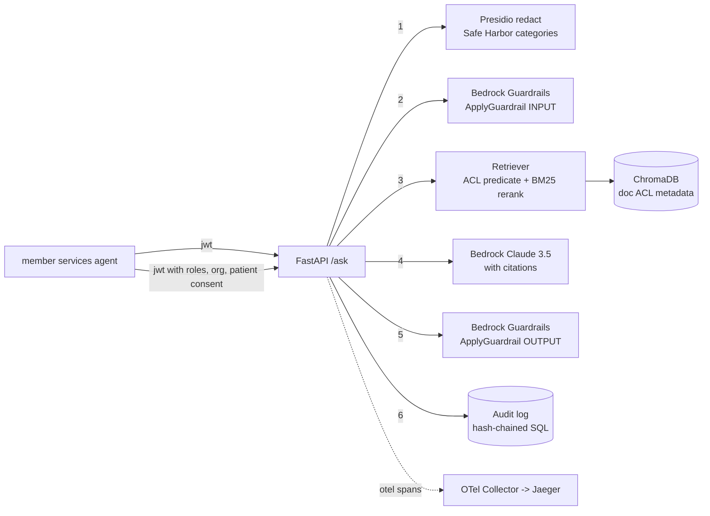

# compliance-rag-pii-redaction

Reference architecture for compliance-constrained retrieval augmented
generation over regulated healthcare text. The goal is a documented,
inspectable design that a Security Officer can walk end to end before
any actual PHI touches the pipeline; it is not a shipped product and it
has not been through a HIPAA readiness review.

## What this repo is

- A worked example of the layers you have to add to plain RAG before it
  clears a HIPAA-style review: PII/PHI de-identification, an identity
  and consent model, prompt and response guardrails, per-request audit,
  and a control-to-code mapping document.
- A code sketch of each layer against a specific stack (Presidio,
  ChromaDB, Bedrock, FastAPI, SQLAlchemy, OpenTelemetry).
- A written HIPAA control map in `docs/hipaa_mapping.md` and an on-prem
  migration outline in `docs/on_prem_deploy.md`.

## What this repo is NOT

- Not a deployed or production system.
- Not a certified HIPAA implementation.
- Not a substitute for a Security Officer review.
- Does not fine-tune the base model.
- Does not implement all 18 Safe Harbor identifiers; the Presidio
  pipeline ships with 8 custom HIPAA recognizers covering 16 identifier
  categories (identifier #17 is out of scope for a text-only pipeline;
  identifier #18 has no dedicated catch-all recognizer).
- Retrieval is dense with BM25 reranking over the dense candidate pool,
  not a fully independent hybrid.
- End-to-end integration against live Bedrock has not been executed;
  the code paths are unit-tested with Bedrock mocked.

## Architecture



Each numbered stage is a distinct span in the OTel trace and a distinct
column in the audit row.

## Request flow

1. Caller presents a bearer JWT with `roles`, `org_id`, and (optional)
   `consented_patient_ids`.
2. Question is passed through Presidio (`src/presidio_redact.py`) which
   strips or pseudonymizes the covered PHI categories. See the mapping
   table in `docs/hipaa_mapping.md`.
3. Redacted question hits Bedrock Guardrails as INPUT; if any policy
   triggers we return a canned refusal and write an audit row.
4. Retrieval builds a Chroma `where` predicate from the caller identity
   (`src/retrieve.py::_acl_where`). The predicate shape uses
   `$contains` and reflects the design intent. The pinned ChromaDB
   version does not accept it as written; callers running against real
   Chroma will need to adapt the predicate to their Chroma version, or
   filter roles in Python alongside the patient consent check. Patient
   consent is enforced in a second-pass Python filter regardless.
5. Dense retrieval against the ACL-filtered set, then BM25 reranking
   over the dense candidate pool, fused with reciprocal rank fusion.
6. Bedrock Claude 3.5 Sonnet generates an answer with inline
   `[source_id:pN#chunk]` citations. The system prompt refuses to
   answer without a chunk.
7. Response is passed back through Bedrock Guardrails as OUTPUT before
   it leaves the process.
8. Audit row is appended to the hash-chained log with request id,
   caller identity, question hash, retrieved chunk ids, redaction
   stats, guardrail verdicts, model, tokens, and cited chunk ids.

## HIPAA control map (quick view)

Full mapping in `docs/hipaa_mapping.md`. This is a design map, not an
assessment. Highlights:

| Control | Reg reference | Code path |
| --- | --- | --- |
| Safe Harbor de-identification (16 covered categories) | 45 CFR 164.514(b)(2) | `src/presidio_redact.py` + `configs/hipaa_recognizers.yaml` |
| Minimum necessary (design) | 45 CFR 164.502(b) | `src/retrieve.py::_acl_where` (Chroma-version-specific) and `_patient_filter` |
| Access control unique user id | 45 CFR 164.312(a)(2)(i) | `src/identity.py`, JWT `sub` claim |
| Automatic logoff | 45 CFR 164.312(a)(2)(iii) | JWT `exp` verification in `src/identity.py::decode_jwt` |
| Encryption at rest (reference IaC) | 45 CFR 164.312(a)(2)(iv) | `terraform/rds.tf`, `terraform/s3.tf` (never applied) |
| Audit controls | 45 CFR 164.312(b) | `src/audit.py` hash chain, `/audit` endpoint |
| Integrity - authenticate ePHI | 45 CFR 164.312(c)(2) | `AuditLog.verify_chain()` (unkeyed SHA-256 chain, tamper-evident only) |
| Person/entity authentication | 45 CFR 164.312(d) | JWT signature verification |
| Transmission security | 45 CFR 164.312(e) | reference: TLS everywhere, Bedrock via VPC endpoints in `terraform/vpc.tf` (not applied) |
| Accounting of disclosures | 45 CFR 164.528 | audit rows with `retrieved_chunk_ids` + `citations` |

The hash chain is unkeyed SHA-256; it is tamper-evident against a naive
editor but not "non-repudiable" and not cryptographically signed.

## Presidio coverage

Categories detected by the Presidio pipeline + custom recognizers:

- Names, geographic subdivisions, dates, telephone, fax, email, SSN
  (partially masked), MRN, health plan beneficiary, account numbers,
  certificate / license (DEA, NPI, DL), vehicle VIN, device serial,
  URLs, IP addresses, biometric identifiers.

Not covered:

- Full-face photographs (identifier #17): out of scope for a text-only
  pipeline.
- Catch-all for "any other unique code" (identifier #18): no dedicated
  detector.

## Quick start

```bash
# 1. install
python -m venv .venv && source .venv/bin/activate
pip install -r requirements.txt
python -m spacy download en_core_web_lg

# 2. env
cp .env.example .env
# fill in AWS creds, JWT_SECRET, PSEUDONYM_SALT (32+ hex chars)

# 3. audit db + vector store
alembic upgrade head            # postgres
python -m scripts.reindex_sample_policies

# 4. api + ui
make api                        # uvicorn on :8080
make ui                         # streamlit on :8501
```

`docker-compose.yml` builds the container images and stands up the
supporting services (ChromaDB, Postgres, Jaeger). The API container is
wired to a local persistent Chroma directory in the current code, so
the standalone chromadb service is stood up but not driven end to end
by the API in that layout; that wiring is a known gap.

## Layout

```
src/
  ingest.py              PDF/DOCX/MD ingestion with page provenance
  presidio_redact.py     Presidio wrapper with 8 custom HIPAA recognizers
  pseudonym.py           HMAC-based deterministic pseudonymization
  embed.py               Bedrock Titan v2 embeddings, local fallback
  store.py               ChromaDB with per-doc ACL metadata
  retrieve.py            ACL predicate + dense retrieval + BM25 rerank
  generate.py            Bedrock Claude 3.5 Sonnet, cited answers
  guardrails.py          Bedrock Guardrails wrapper, escalation paths
  audit.py               Hash-chained audit log
  otel.py                OpenTelemetry GenAI-conv spans
  identity.py            JWT decode -> CallerIdentity
  api/main.py            FastAPI /ask /ingest /audit /health /redact/preview
  api/schemas.py         pydantic v2

configs/
  hipaa_recognizers.yaml
  guardrails_config.json
  system_prompt.md
  otel-collector.yaml

data/sample_policies/    Synthetic (only) clinical policies for demo
migrations/              alembic for audit_log
evals/                   eval set + runner (citation + pii leak checks)
scripts/                 reindex, jwt token issuer, salt rotation
tests/                   redact, acl filter, audit chain, guardrails, api, retrieve
terraform/               reference IaC (never applied): VPC private endpoints, IAM, RDS
docs/
  hipaa_mapping.md       Control map with covered / uncovered notes
  on_prem_deploy.md      Migration outline for an on-prem substitute stack
  audit_log_design.md    Chain invariants, snapshot rules, auditor workflow
```

## On-prem migration outline

See `docs/on_prem_deploy.md`. It is a design outline for what would
need to change to swap Bedrock and other AWS services for on-prem
substitutes (vLLM, NeMo Guardrails, on-prem Postgres, HashiCorp Vault).
The corresponding code branches are not implemented; the outline is
documentation.

## Notes on the sample data

Every file in `data/sample_policies/` is fabricated. Names, MRNs,
phone numbers, dates of birth are made up specifically to exercise
the redaction pipeline. Do not add real PHI to that folder.
